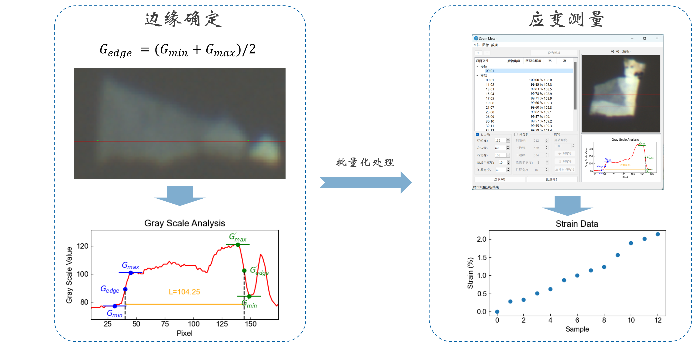
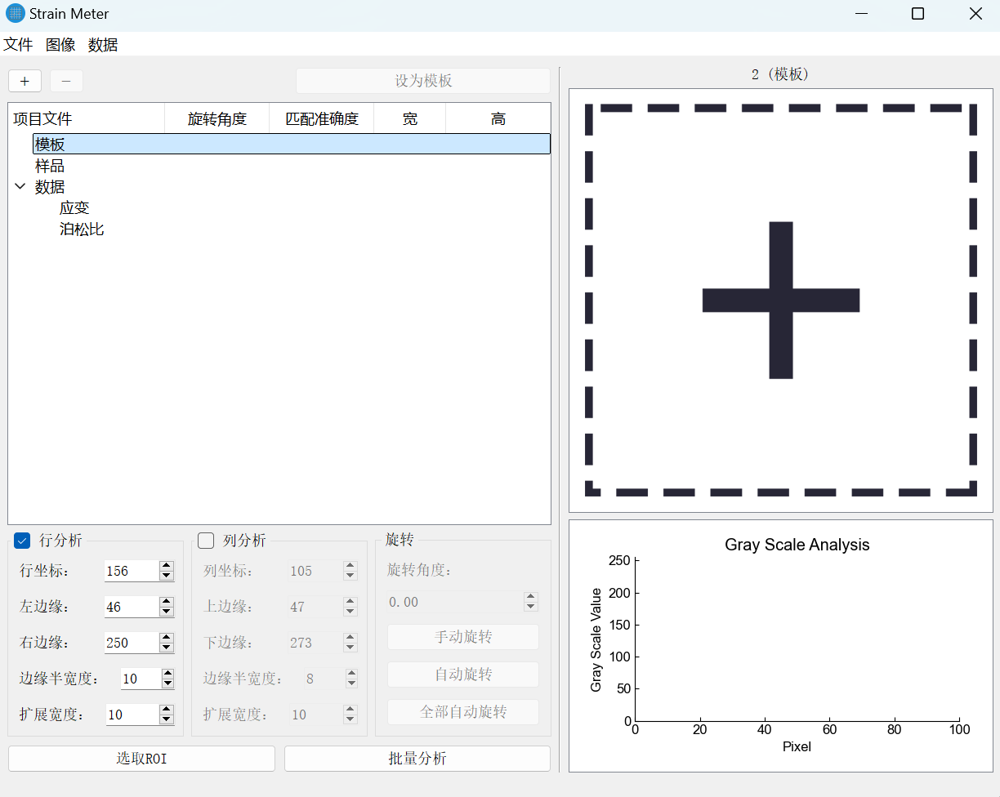
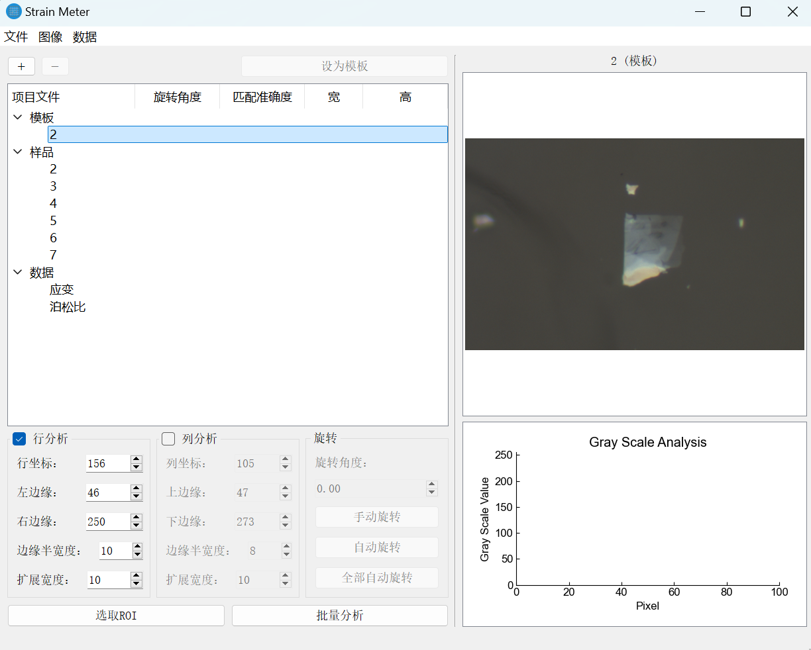
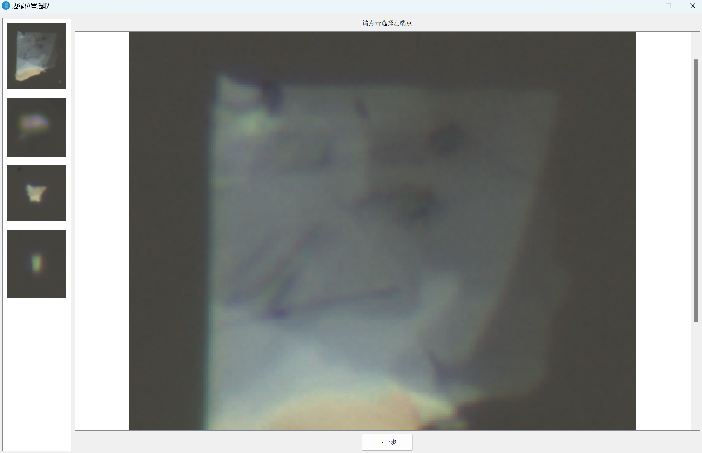
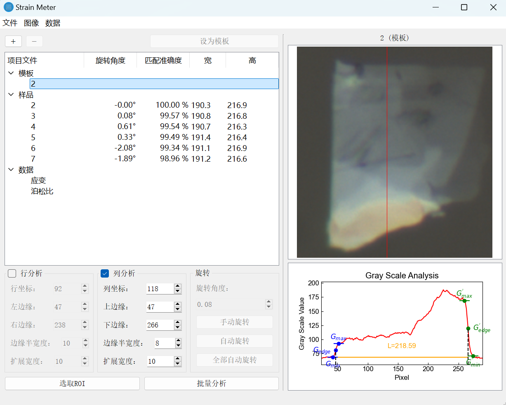
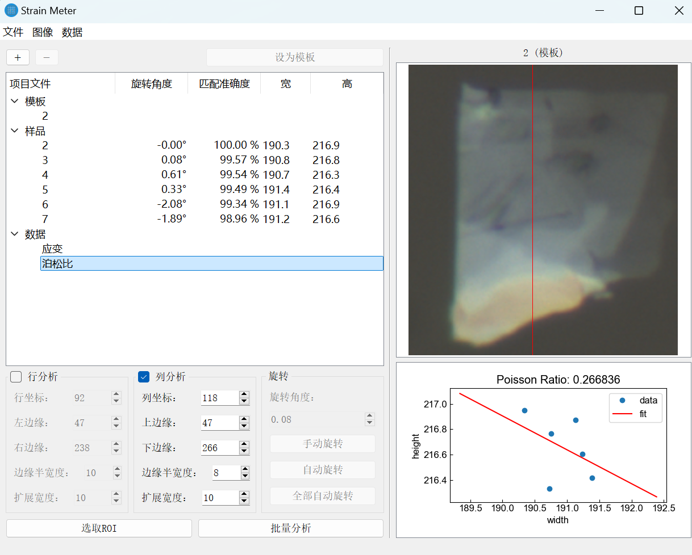

# Strain Meter 原理

在图像法测量应变的过程中，关键在于**准确识别样品在图像中的边缘位置**，从而计算样品的长度变化以估算应变大小。

本项目采用图像灰度值变化来精确定位样品边缘。图像中，样品与衬底背景的灰度值存在明显差异，因而可以利用灰度值的突变来确定边界位置。



上图示意了该方法的基本原理。我们选取图像中的某一行或某一列，提取其灰度值分布，并绘制对应的灰度曲线图。图中可以观察到灰度值从较低值（对应衬底背景）突变至较高值（对应样品），或反之。将灰度值的变化曲线进行分析，可确定两个边缘点的位置 $P_1$ 和 $P_2$，从而估算样品在图像中的像素长度：
\
$$L = P_2 - P_1$$
\
为避免人为阈值选择带来的误差，我们采用如下方式确定边缘位置：
\
$$G_{\text{edge}} = \frac{G_{\text{max}} + G_{\text{min}}}{2}$$
\
其中， $G_{\text{max}}$ 和 $G_{\text{min}}$ 分别为样品区域与衬底背景区域的在边缘邻域的最大和最小灰度值。以该中间值为判断依据，便可自动标定出灰度曲线上边缘点的位置。

通过比较施加应变前后图像中样品长度的变化 $\Delta L$，即可估算应变大小：
\
$$\varepsilon = \frac{\Delta L}{L_0}$$
\
其中， $L_0$ 为初始长度， $\Delta L$ 为变形后的长度增量。

# Strain Meter 使用方法

## 一、启动软件

你可以通过以下两种方式启动 Strain Meter 软件：

### 方法一：通过源码运行

```bash
# 克隆项目代码
git clone https://github.com/fupcode/strain-meter.git
cd strain-meter

# （可选）创建 Python 虚拟环境
python -m venv venv
source venv/bin/activate  # Windows 用户使用 venv\Scripts\activate

# 安装依赖
pip install -r requirements.txt

# 启动 GUI 程序
python GUI/main.pyw
```

---

### 方法二：使用 Release 可执行版本

1. 访问项目Release地址：[https://github.com/fupcode/strain-meter](https://github.com/fupcode/strain-meter/)

2. 点击右侧的 **"Releases"** 标签页，下载最新版本的压缩包。

3. 解压后双击运行 Strain Meter 主程序，无需安装 Python 和依赖。

---

成功运行 `Strain Meter` 后，将弹出如下主窗口：



---

## 二、分析二维材料图像

### 1. 导入图像

点击右侧的加号图标，选择你希望分析的图像文件（支持批量选择）。  
选中后，界面将呈现如下所示的视图：



可点击左上方小加号继续添加图像，或选中样品点减号删去指定图像。

默认第一个为模板，也可选中样品点击设为模板按钮更换模板图像。

### 2. 选取ROI

左下角可以选择是行分析还是列分析，点击左下角选取ROI，将弹出如下窗口



左侧为分析出存在的样品，选中想要分析的样品，然后在右侧主窗口进行如下操作：

- 如果为行分析
  - 点击样品左侧边缘某点，点击下一步按钮
  - 点击样品右侧边缘某点，点击完成按钮

- 如果为列分析
  - 点击样品上侧边缘某点，点击下一步按钮
  - 点击样品下侧边缘某点，点击完成按钮

### 3. 分析样品应变

选择ROI区域后，程序已经尝试对不同图像的对应区域尝试配准，可逐个选中左上角窗格中的样品，在右上角窗格查看配准效果，还可以进行旋转操作。

然后直接点击左下角批量分析按钮进行批量分析

## 三、结果呈现

如果进行了行分析，和列分析，那么结果如图所示



右下角呈现了，某列/某行的灰度变化，通过灰度变化分析出该样品的宽/高。

可点击左上方窗口的泊松比条目，并在右下角看到泊松比分析。



应变数据和泊松比数据均可在左上角的数据菜单栏中导出。

